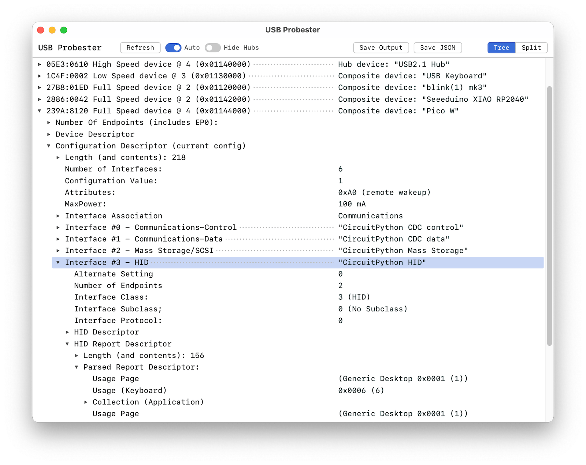

#  USB Probester

A cross-platform (Mac/Win/Linux/RasPi) desktop app for exploring connected USB devices — their
device descriptors, configuration descriptors, interface and endpoint
details, and parsed HID report descriptors. Spiritual successor to Apple's
__`USB Prober.app`__.

Also ships a standalone CLI ([`usb-probester-cli`](#commandline-tool-usb-probester-cli))
for text or JSON output.




## What does this do? 

USB Probester displays deep information about USB devices, coming from the 
devices themselves in the form of a variety of data packets called "descriptors".

The USB descriptors that this app parses and displays include:

- **Device Descriptor** -- device type, vender ID, product ID, Manufactor strings, serial number
- **Config Descriptor** -- Power required, how many interfaces and what type (CDC, MSC, Audio, etc.)
- **HID Report Descriptor** -- If a Human Interface Device lie a mouse, keyboard or similar,
  the types and format of HID data packets ("reports") sent to and from the device
 
The app displays this information in a tree-like structure, but not a a tree
of connections but of configuration. Much of a USB device's configuration
is hierarchical.  or example, a kebyoard has a configuration descriptor, 
which has one or more interfaces. One of those interfaces is a HID interface, 
which contains a HID report descriptor with one or more reports defined. 
This app does not show bus topology but configuration hierarchy.

---

## Why does this exist?

Apple shipped `USB Prober.app` as part of the **Hardware IO Tools for Xcode**
developer tools package. It was invaluable for USB device development: it showed
the full descriptor tree for every attached device, including the raw bytes of
configuration descriptors and a parsed rendering of HID report descriptors.

Apple quietly dropped it. The last version stopped working on modern macOS
(Apple Silicon / macOS 12+), the download was removed from the developer portal,
and no replacement was provided.

USBProbester aims to fill that gap with a native, cross-platform tool that
shows the same level of detail USB Prober did — and eventually more.

The reference fixture files in `tests/fixtures/usb-prober-reference*.txt` are
real output captures from the original USB Prober, used as the ground truth for
output format and correctness.

---

## GUI features

- **Tree view** — full collapsible descriptor tree matching Mac USB Prober's layout
- **Split view** — device list on the left, tabbed descriptor panels on the right
- **Row selection** — click or click-drag to select rows line-by-line; shift+click extends the range; `Cmd+C` copies selected rows as formatted text matching Save Output
- **Save Output** (`Cmd/Ctrl+S`) — native save dialog; writes Mac USB Prober-style `.txt`
- **Save JSON** (`Cmd/Ctrl+Shift+S`) — native save dialog; writes pretty-printed `.json`
- **Refresh** (`Cmd/Ctrl+R`) — re-enumerates all connected devices on demand
- **Auto-refresh** — toggle to watch for USB attach/detach events and refresh automatically

---

### Commandline tool `usb-probester-cli`

A standalone `usb-probester-cli` binary is included that doesn't require
the GUI or a web runtime.

With no arguments it prints an `lsusb`-style device list:

```
$ usb-probester-cli
Bus 001 Dev 1-1.3.4.4      : ID 239a:802c  Adafruit Industries LLC ItsyBitsy M4 Express
Bus 001 Dev 1-1.3          : ID 0409:005a  NEC Corp. HighSpeed Hub
Bus 001 Dev 1-1            : ID 2109:3431  VIA Labs, Inc. USB2.0 Hub
Bus 002 Dev 2-2            : ID 04e8:6300  Samsung Flash Drive FIT
Bus 001 Dev 1-1.3.4.3      : ID 27b8:01ed  ThingM blink(1) mk3
```

Vendor and product names come from the device's own string descriptors when
available, falling back to the bundled [USB ID database](https://usb-ids.gowdy.us/)
for devices that don't report strings (no network access or OS package required).

```bash
# lsusb-style list (default)
usb-probester-cli

# Full Mac USB Prober-style descriptor dump
usb-probester-cli --dump

# Pretty-printed JSON
usb-probester-cli --format json

# Filter by vendor ID and/or product ID (hex, with or without 0x prefix)
usb-probester-cli --vid 27b8
usb-probester-cli --vid 27b8 --pid 01ed
usb-probester-cli --format json --vid 0x27b8

# Omit USB hubs
usb-probester-cli --hide-hubs
```

--- 

## Status

| Platform | Collector        | HID Parser | GUI        | CLI        |
|----------|------------------|------------|------------|------------|
| macOS    | ✓ full           | ✓ working  | ✓ working  | ✓ working  |
| Linux    | ✓ full           | ✓ shared   | ✓ working  | ✓ working  |
| Windows  | ✓ full¹          | ✓ shared   | ✓ working  | ✓ working  |

¹ All devices show VID/PID, speed, strings, and configuration descriptors.
HID report descriptors are reconstructed via `HidD_GetPreparsedData` and the
public `HidP_` capability APIs — the same approach used by `hidapi`. The
reconstructed descriptor is valid and parseable but is not byte-identical to
the original: vendor-specific items are absent and sub-collection nesting is
flattened. This works for all HID devices regardless of driver (HID.sys, WinUSB, etc.).

---

## Building

This app is built with [Tauri v2](https://tauri.app)
(Rust backend, React/TypeScript frontend), using the [`nusb`](https://docs.rs/nusb/latest/nusb/)
Rust library for most USB data collection but a few OS-specific tricks where warranted. 

If you're unfarmiliar with Tauri, this app requires the following tools need to be installed: 

- **Rust** — [rustup.rs](https://rustup.rs)
- **Node.js** — v18 or later [nodejs.org](https://nodejs.org)
- **Tauri CLI** — installed via `npm install`

This is a pretty standard Tauri2 app with local Rust crates.
If you're familiar with that, building this app should be familiar. 

```bash
# Install JS dependencies
npm install

# Build all Rust crates
cargo build

# Run the Tauri dev server (hot-reload frontend + Rust backend)
npm run tauridev  # (will also build needed crates)

# Build a release app bundle
npm run tauribuild

# Build CLI tool usb-probester-cli
cargo build --release -p usb-cli
./target/release/usb-probester-cli -h

```
### OS-specific requirements:

- Linux: 

  - Install GTK/WebKit system libraries (Ubuntu/Debian):
  
    ```bash
    sudo apt install libglib2.0-dev libgtk-3-dev libwebkit2gtk-4.1-dev \
                     libayatana-appindicator3-dev librsvg2-dev
    ```

- Windows:

  - [Visual Studio Build Tools 2022](https://visualstudio.microsoft.com/downloads/#build-tools-for-visual-studio-2022)
  with the **"Desktop development with C++"** workload. Use the MSVC toolchain
  (the default from rustup on Windows) — the MinGW/GNU toolchain does not work
  with Tauri. WebView2 is pre-installed on Windows 11.

  - *Windows cross-compilation note:* if building on an ARM Windows machine and
    targeting x86_64 machines, add the target and build explicitly:

    ```
    rustup target add x86_64-pc-windows-msvc
    cargo build --release -p usb-cli --target x86_64-pc-windows-msvc
    # → target\x86_64-pc-windows-msvc\release\usb-probester-cli.exe
    ```

- MacOS: 

  - If you build by hand, you probably have an unsigned binary, to fix that, 
    clear the quarantine attribute:

    ```bash
    xattr -cr target/release/usb-probester-cli
    ```

--- 

### Workspace layout

```
crates/
  usb-types/              — shared Rust data model (serde + specta types)
  usb-collector-macos/    — macOS USB enumeration via nusb + ioreg HID pass
  usb-collector-linux/    — Linux USB enumeration via nusb + sysfs parsing
  usb-collector-windows/  — Windows USB enumeration via nusb (partial)
  usb-formatter/          — Format USB data into human-readable form
  hid-parser/             — platform-agnostic HID report descriptor parser
  usb-cli/                — standalone CLI binary (usb-probester-cli)
src-tauri/                — Tauri shell, backend commands, text formatter
src/                      — React/TypeScript frontend
tests/fixtures/           — reference output from original USB Prober.app
```


### Running the collectors (no UI needed)

Each OS has it's own "collector" to get information about USB devices. 

These examples validate the collector and HID parser against real hardware
(or stored fixture data) without launching the full app.

### Linux

```bash
# Structured dump of all connected USB devices — descriptors, endpoints, HID
cargo run -p usb-collector-linux --example dump_one

# Parse a stored sysfs descriptor binary (no hardware required):
#   no argument  → built-in blink(1) mk2 fixture
#   path argument → any /sys/bus/usb/devices/<dev>/descriptors file
cargo run -p usb-collector-linux --example from_sysfs_file
cargo run -p usb-collector-linux --example from_sysfs_file -- /sys/bus/usb/devices/2-4/descriptors
```

### macOS

```bash
# Structured field dump — raw descriptor bytes, endpoint table, HID hex
cargo run -p usb-collector-macos --example dump_one

# USB Prober-style text output — matches the reference fixture format
cargo run -p usb-collector-macos --example prober_fmt
```

---

## Tests

```bash
# Run all tests across the workspace
cargo test

# HID parser golden test only
# Parses the 156-byte Pico 2 HID descriptor and asserts the rendered output
# matches tests/fixtures/usb-prober-reference0.txt lines 199–276 exactly.
cargo test -p hid-parser

# Clean all build artifacts
npm run clean
```

---

## How the collectors work

### Linux (`crates/usb-collector-linux`)

Everything comes from sysfs — no device open, no elevated privileges:

1. **`nusb::list_devices()`** — provides device metadata: bus number, port
   chain, cached string descriptors (manufacturer/product/serial), and speed.

2. **`/sys/bus/usb/devices/<dev>/descriptors`** — world-readable binary file
   containing the raw bytes of the device descriptor (18 bytes) followed by
   the full configuration descriptor blobs, exactly as returned by the device.
   Parsed by `crates/usb-collector-linux/src/descriptor.rs`.

3. **HID report descriptors** — located at
   `/sys/bus/usb/devices/<dev>/<dev>:<cfg>.<iface>/0003:<VID>:<PID>.<N>/report_descriptor`.
   The `0003:` prefix identifies HID bus entries. Collected by
   `crates/usb-collector-linux/src/hid.rs`.

### Windows (`crates/usb-collector-windows`)

Uses `nusb::list_devices()` for enumeration. nusb opens devices via the Windows
USB device interface, giving descriptor read access for all devices regardless
of driver.

HID report descriptors are retrieved via `src/hid.rs` using the preparsed-data
approach (the same strategy used by `hidapi`):

1. SetupDi enumerates all HID device interfaces via `GUID_DEVINTERFACE_HID`.
2. Each interface is opened with `CreateFile` and queried via `HidD_GetAttributes`
   (VID/PID) and `HidD_GetSerialNumberString`.
3. `HidD_GetPreparsedData` returns an opaque capability handle, which
   `HidP_GetCaps`, `HidP_GetButtonCaps`, and `HidP_GetValueCaps` decode into
   button and value capability lists for Input, Output, and Feature report types.
4. A synthetic HID report descriptor is reconstructed from those capabilities
   using standard HID short-item encoding.

The reconstructed descriptor is valid and parseable but not byte-identical to the
original: vendor-specific items are absent and sub-collection nesting is flattened.
This approach works for all HID devices regardless of driver (HID.sys, WinUSB, etc.).

Hub IOCTLs (`IOCTL_USB_GET_DESCRIPTOR_FROM_NODE_CONNECTION`) cannot retrieve HID
class descriptors because the Windows kernel unconditionally overwrites the
`bmRequest` field to `0x80`, making class-specific requests impossible.
`HidD_GetReportDescriptor` is kernel-mode only and not callable from user space.

### macOS (`crates/usb-collector-macos`)

USB enumeration uses two passes:

1. **`nusb` crate** — wraps IOKit directly (no libusb) to enumerate devices
   and retrieve raw descriptor bytes (`GET_DESCRIPTOR(DEVICE)` and
   `GET_DESCRIPTOR(CONFIGURATION)`). `ioreg -a -p IOUSB` only exposes parsed
   field values, not raw bytes, so nusb is necessary for the hex dump display.

2. **`ioreg -a -c IOHIDInterface`** — HID report descriptor bytes live on
   `IOHIDInterface` nodes, not on the USB device node. A separate ioreg pass
   extracts them and correlates them to the nusb device via `LocationID`.

---

## Reference links

### Standards

- [USB 2.0 Specification](https://www.usb.org/document-library/usb-20-specification) — device/config/interface/endpoint descriptor formats
- [HID Usage Tables 1.5 (HUT)](https://usb.org/document-library/hid-usage-tables-15) — usage page and usage name lookup
- [HID Class Specification 1.11](https://www.usb.org/document-library/device-class-definition-hid-111) — report descriptor item stream format

### Rust crates

- [nusb](https://crates.io/crates/nusb) — pure-Rust USB library wrapping IOKit on macOS and WinUSB on Windows
- [Tauri v2](https://tauri.app) — Rust + web frontend desktop app framework
- [specta](https://github.com/oscartbeaumont/specta) + [tauri-specta](https://github.com/oscartbeaumont/tauri-specta) — automatic TypeScript type generation from Rust types
- [plist](https://crates.io/crates/plist) — plist parsing for ioreg XML output
- [clap](https://crates.io/crates/clap) — CLI argument parsing for `usb-probester-cli`
- [usb-ids](https://crates.io/crates/usb-ids) — bundled USB ID database for vendor/product name lookup

### Reference implementations

- [Apple Hardware IO Tools (archived)](https://developer.apple.com/download/all/?q=hardware%20io%20tools) — the original USB Prober
- [Microsoft USBView](https://github.com/microsoft/Windows-driver-samples/tree/main/usb/usbview) — reference for Windows IOCTL-based USB enumeration
- [Linux `/sys/bus/usb`](https://www.kernel.org/doc/html/latest/driver-api/usb/usb.html) — sysfs USB device tree

### Related tools

- [lsusb for Linux](https://linux.wiki/docs/commands/system-info/lsusb/) — Linux, no HID report descriptor usually
- [lsusb for Mac OS X](https://github.com/jlhonora/lsusb) — macOS (pre-Tahoe) only and only partial data
- [USBDeview](https://www.nirsoft.net/utils/usb_devices_view.html) — Windows-only
- [USB Device Tree Viewer](https://www.uwe-sieber.de/usbtreeview_e.html) — Windows-only
